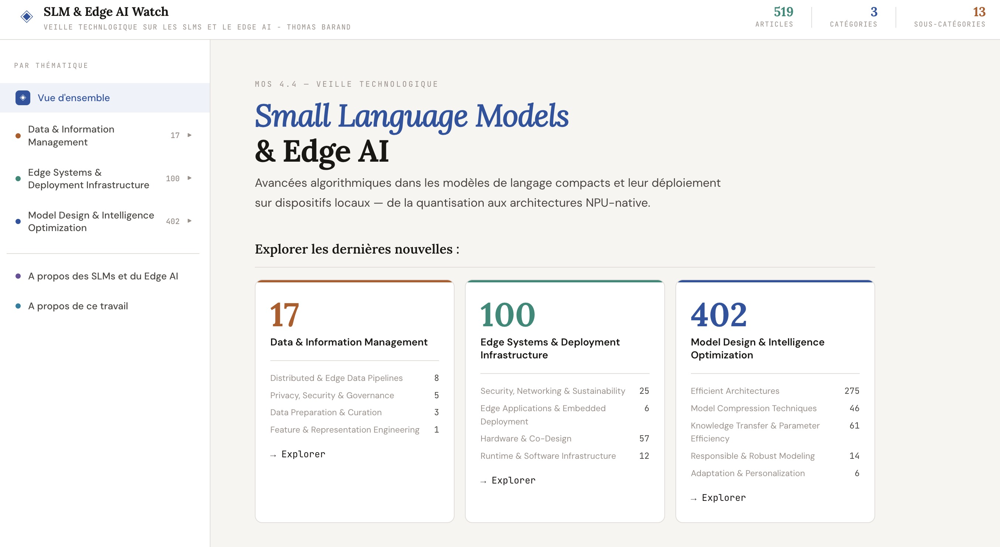
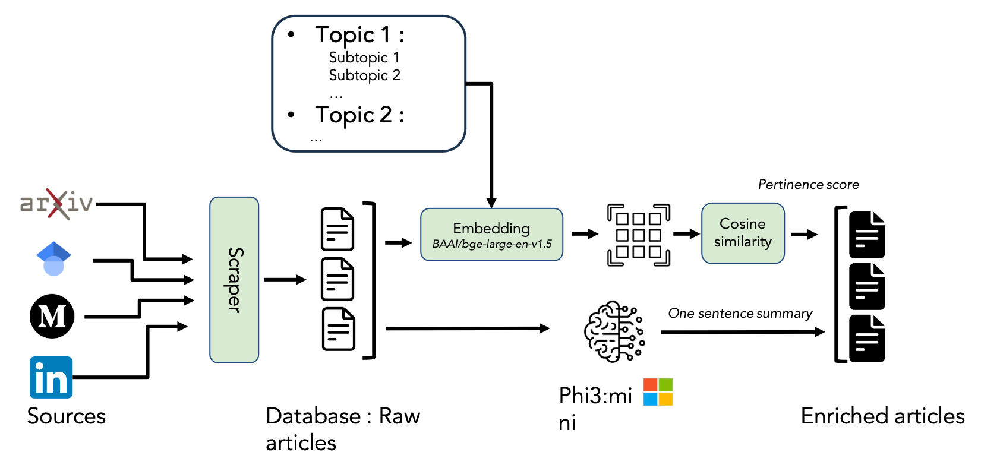
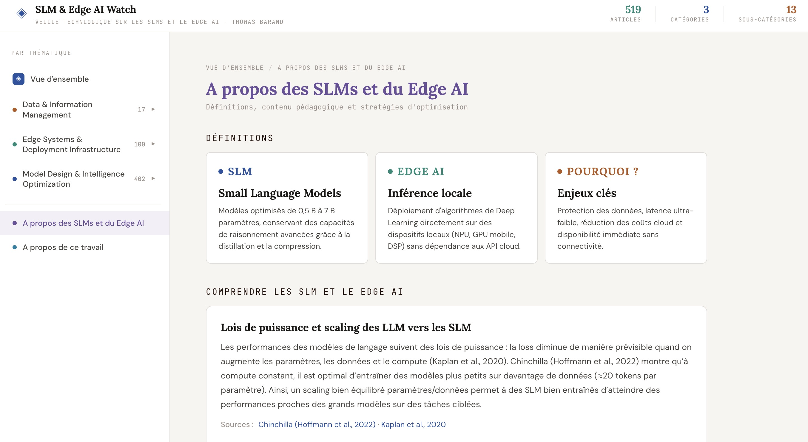
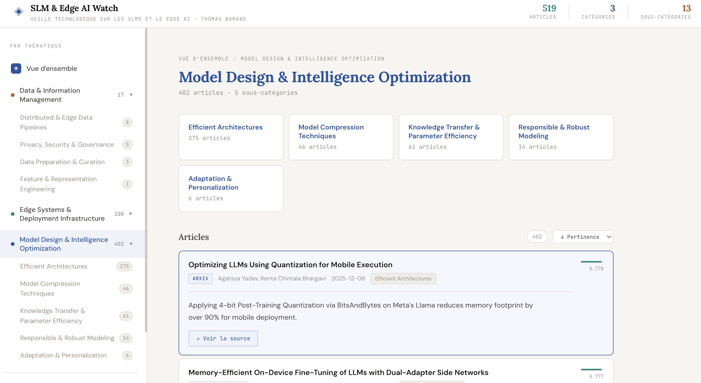

# SLM & Edge AI — Veille Technologique

Projet de veille technologique (MOS 4.4) sur les **Small Language Models (SLM)** et le **Edge AI** : collecte d’articles et de papers, enrichissement par classification (taxonomie), et exploration via un site web statique interactif.

---

## Projet et livrables

| Livrable | Description |
|----------|-------------|
| **Code** | Scripts Python (scraper, merge, export) et notebooks d’analyse (Colab / local). |
| **Scraper** | Collecte multi-sources (arXiv, Semantic Scholar, LinkedIn, Medium) → `raw_articles.json`. |
| **Process** | Pipeline données brutes → enrichissement (catégories, résumés) → export pour le site. |
| **Website** | Site statique (HTML/CSS/JS) pour explorer la taxonomie et les articles, avec pages « À propos ». |

Le site est disponible en suivant le lien : https://thomas0barand.github.io/slm_survey/



---

## Pipeline données et scraping

### Vue d’ensemble du flux



### Répertoires et rôles

| Répertoire / fichier | Rôle |
|----------------------|------|
| `data/` | Données du pipeline : `raw_articles.json`, `enriched_articles.json` (générés, à ne pas versionner si sensibles). |
| `src/` | Code Python et notebooks. |
| Racine (index.html, app.js, style.css, data.js) | Site web statique ; `data.js` est généré par `export.py`. |

### Scripts et fonctions principales

#### 1. Scraping — `src/scraper.py`

- **Rôle :** Interroger arXiv, Semantic Scholar, LinkedIn (Playwright), Medium ; normaliser les entrées et écrire `data/raw_articles.json`.
- **Config :** `.env` pour `SEMANTIC_SCHOLAR_API_KEY` si besoin. Constantes en tête de fichier : `MAX_*_PER_QUERY`, `DAYS_LOOKBACK`, `DATA_DIR`, `OUTPUT_PATH`.
- **Sources :**
  - **arXiv** : catégories `cs.AI`, `cs.LG`, `cs.CL` ; groupes de requêtes (SLM, Edge AI, quantization, pruning/distillation, hardware/inference) dans `ARXIV_QUERY_GROUPS`.
  - **Semantic Scholar** : requêtes dérivées des mêmes thèmes.
  - **LinkedIn / Medium** : via Playwright (optionnel, selon config).
- **Sortie :** Objets avec `title`, `authors`, `summary`, `published_date`, `url`, `source`, `citation_text` (APA), etc.

**Utilisation :**

```bash
python src/scraper.py
```

Génère ou met à jour `data/raw_articles.json`.

#### 2. Fusion des exports bruts — `src/merge_raw_articles.py`

- **Rôle :** Fusionner plusieurs fichiers `raw_articles_*.json` dans `data/` en un seul `raw_articles.json`, avec déduplication par titre normalisé. Ignore les entrées dont la source est `google_scholar` (pour éviter doublons avec d’autres flux).
- **Fonction principale :** `merge_json_files()` — scanne `data/`, fusionne les listes, déduplique, écrit `data/raw_articles.json`.

**Utilisation :**

```bash
python src/merge_raw_articles.py
```

À lancer après des runs de scraper qui ont produit des fichiers préfixés `raw_articles_` (ex. par date ou source).

#### 3. Enrichissement (hors repo strict)

- **Rôle :** À partir de `raw_articles.json`, attribuer catégorie / sous-catégorie (taxonomie) et résumés (ex. via un modèle local ou Colab).
- **Fichiers concernés :** `src/analyzer_colab.ipynb`, `src/analyzer_local.ipynb` (ou tout script qui lit `raw_articles.json` et écrit `enriched_articles.json`).
- **Sortie attendue :** `data/enriched_articles.json` avec au moins : `title`, `authors`, `summary`, `ai_summary`, `published_date`, `url`, `source`, `category`, `subcategory`, `category_confidence`, `subcategory_confidence`, `needs_review`.

#### 4. Export pour le site — `src/export.py`

- **Rôle :** Lire `data/enriched_articles.json` et générer `data.js` à la racine du repo (à côté de `index.html`).
- **Contenu de `data.js` :** Variables globales `ARTICLES_DATA` et `TAXONOMY_DATA` utilisées par `app.js` (liste d’articles avec champs simplifiés + taxonomie cat → sous-cat → effectifs).
- **Fonctions utiles :** `relevance(a)` pour le score d’affichage ; tri par pertinence avant export.

**Utilisation :**

```bash
python src/export.py
```

À lancer après toute mise à jour de `enriched_articles.json` pour mettre à jour le site.

### Utilisation globale du repo (ordre typique)

```bash
# 1. Collecte
python src/scraper.py

# 2. (Optionnel) Fusion si plusieurs fichiers raw
python src/merge_raw_articles.py

# 3. Enrichissement (notebook Colab ou local)
#    → produire data/enriched_articles.json

# 4. Génération des données du site
python src/export.py

# 5. Ouvrir le site (fichiers statiques)
# Ouvrir index.html dans un navigateur ou servir le dossier (ex. python -m http.server)
```

---

## Site web

Le site est une SPA légère en HTML/CSS/JS. Il charge `data.js` (généré par `export.py`) et affiche :

- **Vue d’ensemble :** cartes par catégorie (exploration des dernières nouvelles), section « À propos » (définitions SLM/Edge AI + à propos du travail), organigramme du projet.
- **Pages catégorie / sous-catégorie :** liste d’articles avec tri (pertinence, date, titre), résumé et lien vers la source.
- **Pages « À propos » :** contenu pédagogique (définitions, stratégies) et page projet (organigramme, contacts, dépôt).

### Captures d’écran

**Page principale (vue d’ensemble et exploration)**


**Section définitions et contenu (À propos des SLMs et du Edge AI)**



**Dernières nouvelles (exploration par catégorie)**



---

## Structure du dépôt

```
slm_survey/
├── README.md
├── index.html, app.js, style.css, data.js   # Site web (data.js généré)
├── requirements.txt
├── data/
│   ├── raw_articles.json      # Sortie scraper / merge
│   └── enriched_articles.json  # Sortie enrichissement
├── images/                    # Visuels du site et du README
│   ├── websitemainpage.png
│   ├── website_definitions.png
│   └── websitelastenews.png
├── src/
│   ├── scraper.py             # Collecte multi-sources
│   ├── merge_raw_articles.py  # Fusion et déduplication raw
│   ├── export.py               # enriched → data.js
│   ├── analyzer_colab.ipynb    # Enrichissement (Colab)
│   ├── analyzer_local.ipynb    # Enrichissement local
│   └── explore.ipynb           # Exploration des données
└── documentation/             # Docs projet (sujet, etc.)
```

---

## Prérequis

- Python 3.10+
- Dépendances : `arxiv`, `semanticscholar`, `playwright`, `python-dotenv`, etc. (voir `requirements.txt`)
- Pour le scraper : clé API Semantic Scholar optionnelle (`.env`), Playwright installé si usage LinkedIn/Medium

---

*Détails du sujet et de la spec : `documentation/`*
